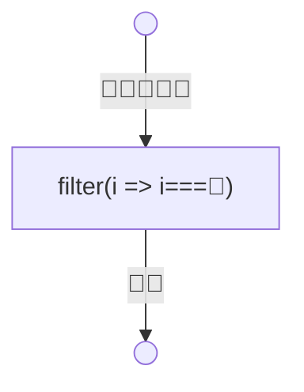
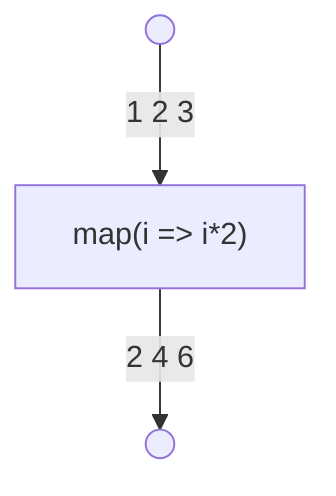
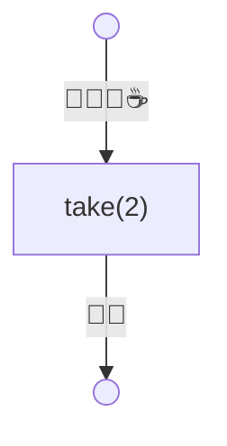
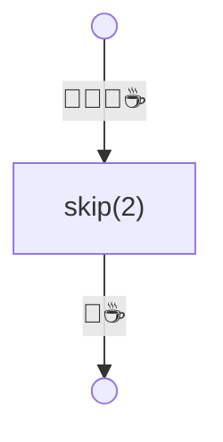
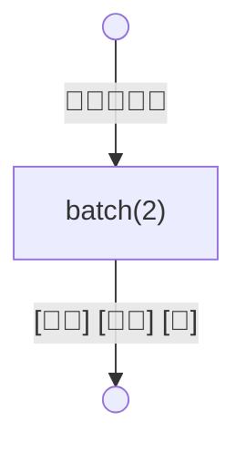
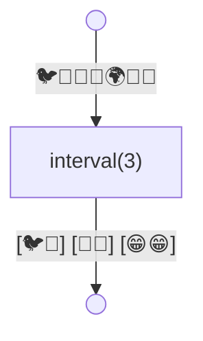
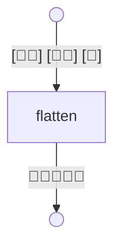
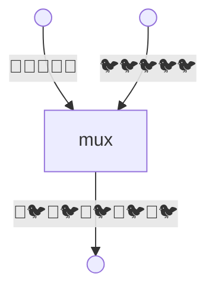

## Filter

```ts
chain(["🐍", "🦔", "🐍", "🐍", "🦔"]).filter((i) => i === "🦔");
```



## Map

```ts
chain([1, 2, 3]).map((i) => i * 2);
```



## Take

```ts
chain(["🍎", "🍌", "🍇", "☕"]).take(2);
```



## Skip

```ts
chain(["🍎", "🍌", "🍇", "☕"]).skip(2);
```



## Batch

```ts
chain(["🍎", "🍎", "🍎", "🍎", "🍎"]).batch(2);
```



## Interval

```ts
chain(["🐦", "🦋", "🌻", "🐯", "🌍", "👋", "😁"]).interval(3);
```



## Flatten

```ts
chain([["🍎", "🍎"], ["🍎", "🍎"], ["🍎"]]).flatten();
```



## Mux

The interleaving below is only an example: the order across inputs is not defined, the order within each input is kept.

```ts
chain(
    mux([
        ["🍎", "🍎", "🍎", "🍎", "🍎"],
        ["🐦", "🐦", "🐦", "🐦", "🐦"],
    ]),
);
```


